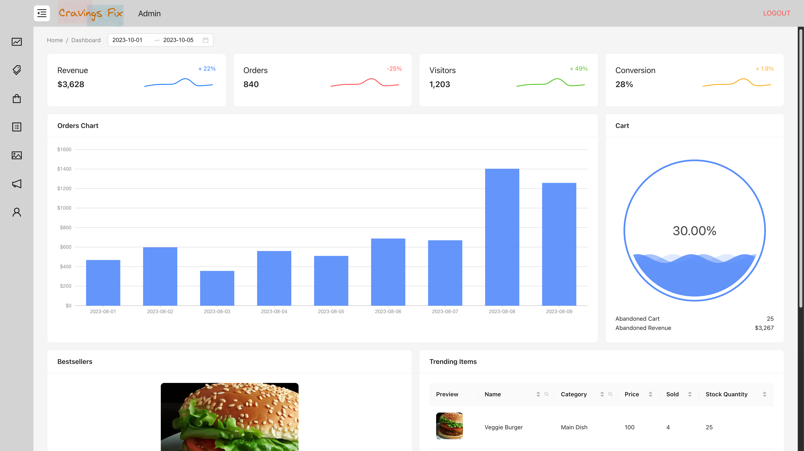
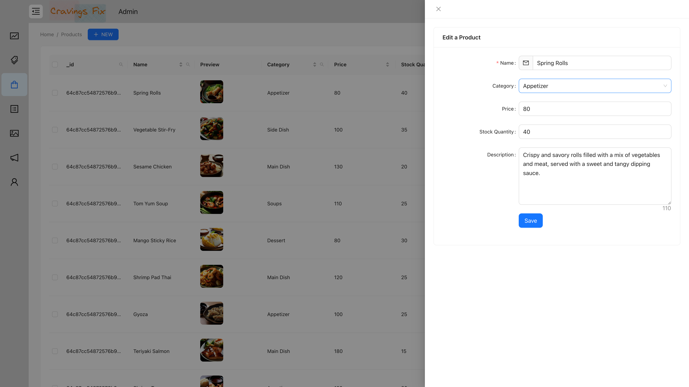
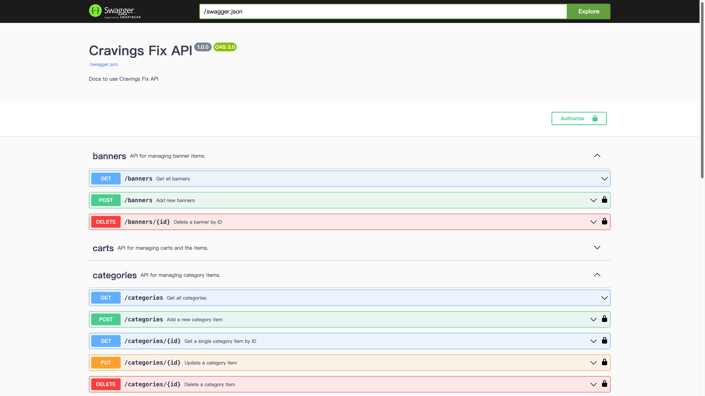
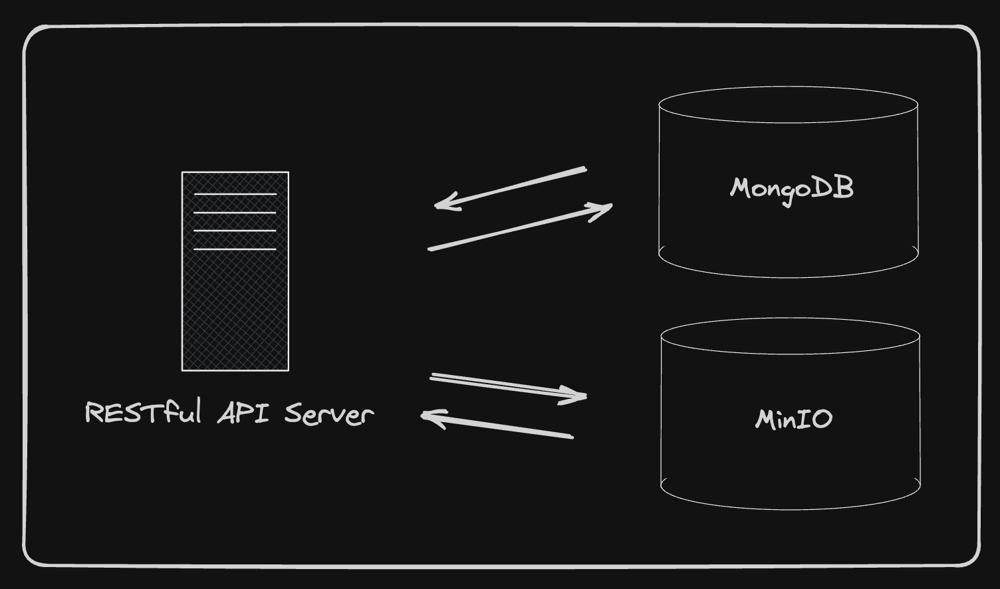

## Intro

A monorepo project with `client-side application`, `content management system(CMS)`, and `Web API` inside

```
(root)
  |_app
    |__client
    |__admin
    |__api
```

## Client-Side

<div style="display:flex;gap:0.5rem">
  
  
</div>

## Content Management System(CMS)

<div style="display:flex;gap:0.5rem">
  
  
</div>

## RESTful API

<div style="display:flex;gap:0.5rem" />
  
  
</div>
